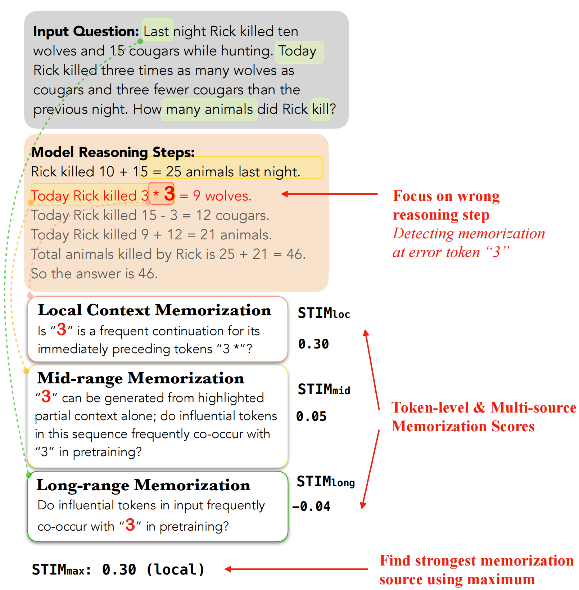
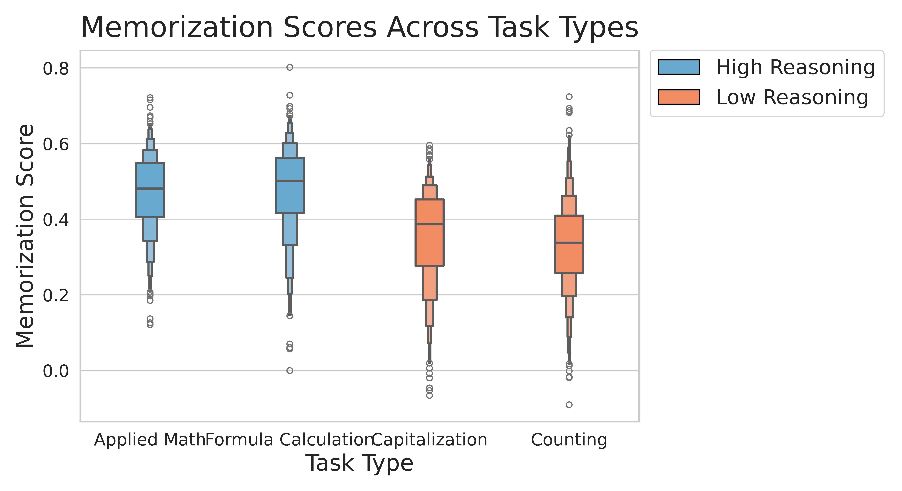
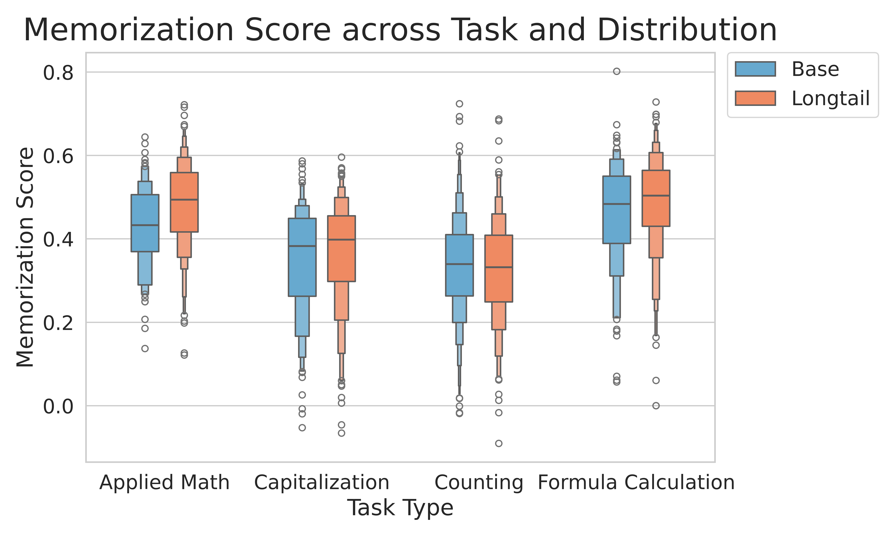
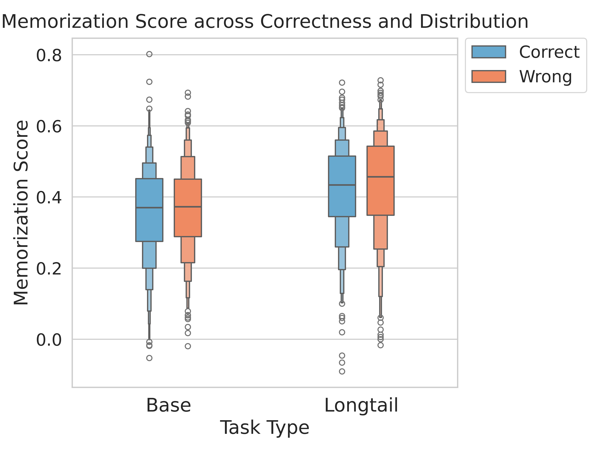

# Diagnosing Memorization in Chain-of-Thought Reasoning, One Token at a Time
This repository contains code and data for paper "Diagnosing Memorization in Chain-of-Thought Reasoning, One Token at a Time"

## Quick Links
- [Introduction](#introduction)
- [Environment Setup](#environment-setup)
- [Data](#data)
- [Model Inference](#model-inference)
- [STIM Framework for Token Level Memorization](#stim-framework-for-token-level-memorization)
    - [Wrong Reasoning Step Identification](#wrong-reasoning-step-identification)
    - [Selecting Candidate Tokens and Alternatives](#selecting-candidate-tokens-and-alternatives)
    - [Pre-training Corpus search based on token saliency scores](#pre-training-corpus-search-based-on-token-saliency-scores)
- [Analysis](#analysis)
    - [Memorization Score Comparision](#memorization-score-comparision)
    - [Wrong Tokens Identification](#wrong-tokens-identification)

## Introduction
In this work, we introduce **STIM**, a novel framework for **S**ource-aware **T**oken-level **I**dentification of
**M**emorization, which attributes each token in a reasoning chain to one of multiple memorization sources – local, mid-range, or long-range based on their statistical co-occurrence with the
token in the pretraining corpus. We implement token-level analysis across different reasoning tasks, distributional settings and correctness as well as identifying and explaining dominant memorization source of wrong tokens by utilizing STIM.

<p align="center">

</p>

## Environment Setup
Run the following command on your local machine to create the environment and install the dependencies.

```bash
conda create -n stim python=3.9
conda activate stim
pip install -r requirements.txt
```

## Data
Data for different reasoning tasks are in `./data/{task_name}`. The base and long-tail version of different tasks include:

* **Applied Math/Formula Calculation**:
    - Original: Raw questions or equations from GSM8K. Data is in `./data/{task_name}/original.json`
    - Changing Base: Transform the original question into base-2 version. Data is in `./data/{task_name}/changing_base.json`
    - Digit Expansion: Replace the number entity $var$ in the original question to $p_1 \times var + p_2$, where $p_1, p_2$ are prime numbers between 10 to 30. Data is in `./data/{task_name}/digit_expand.json`
    - Int-to-Float Conversion: Divide the original variable by 100. Data is in `./data/{task_name}/int_to_float.json`

* **Counting**: 
    - Fruit Pre-training Frequency: The frequency magnitude of fruits is $10^r$, where $r \in \{3, 4, 5, 6, 7\}$.
    - Fruit List Length: The length of the fruit list $l$ is in $\{10, 20, 30, 40, 50\}$.
    
    Data with certain $r$ and $l$ is in `./data/counting/range_in_{r}/length-{l}.json`

* **Capitalization**: We provide two task types:

    - Title Case (base version): Change the format of the string to be a title. 
    - Capitalize Last word (long-tail version): Capitalize the first letter of the last word in the string.
    
    Data is in `./data/cap/book_title.json`

Each sample is in the following format:

```python
# Applied Math
{   "ori_question": __, # str, the original question in GSM8K
    "question": __, # str, the question under distribution shift
    "answer": __, # str, the correct answer for the question under distribution shift
    "q_type": __, # str, distribution type, can only be "base" or "longtail"
}

# Formula Calculation
{
    "ori_equation": __, # str, the original equation in GSM8K final solution
    "equation": __, # str, the equation under distributional shift
    "answer": __, # str, the correct answer for the question under distribution shift
    "q_type": __, # str, distribution type, can only be "base" or "longtail"
}

# Counting
{
    "num_a": __, # int, the number of fruit_a in the list
    "num_b": __, # int, the number of fruit_b in the list
    "seed": __, # int, seed for fruit list generation, which denotes the order of fruits in the list, ranges from 40 to 50
    "fruit_pair": __, # list[str], two kinds of fruit in the list
    "question": __, # str, question given to the model
    "target": __, # str, the target fruit index in fruit pair list, can only be "0" or "1"
    "q_type": __, # str, distribution type, can only be "base" or "longtail"
}

# Capitalization
{
    "original": __, # str, the original string
    "title": __, # str, the string in the title format
    "caplast": __, # str, the string whose first letter of last word is capitalized
    "question": __, # str, the question given to the model
    "task_type": __, # str, the type of capitalization task, can only be "title" or "caplast"
}
```

## Model Inference
Run the following script in `src` to get model generation of reasoning tasks as well as evaluating correctness:

```bash
./gen_eval.sh
```

In `gen_eval.sh`, it contains model generation code (applied math task as an example) as follows:

```bash
python ./gen_eval/applied/inference.py \
    --model_name __ # Model to inference, default="olmo_13b_instruct" \
    --data_path __ # The path of data \
    --output_path __ # The path of model generation result \
    --perturbation_type __ # The distribution type, can be "original", "changing_base", "digit_expand" or "int_to_float", default="original" \
    --few_shot_path __ # The file path of few shot examples \
    --batch_size __ # Batch size for model generation, default=2 \
    --max_new_tokens __ # Maximum new tokens for generation, default=512
```

The evaluation code for model generation (applied math task as an example) can be run with:

```bash
python evaluate.py \
    --model_output_path __ # File path for model's generation \
    --perturbation_type __ # The distribution type, can be "original", "changing_base", "digit_expand" or "int_to_float", default="original"
```

## STIM Framework for Token Level Memorization
The token-level memorization calculation includes three key steps: **Wrong Reasoning Step Identification**, **Selecting Candidate Tokens and Alternatives** and **Pre-training Corpus Search Based on Token Saliency Scores**

### Wrong Reasoning Step Identification
We use a Process Reward Model (VersaPRM) to identify the first errorneous reasoning step. Run with:

```bash
./get_reward.sh
```

In the `get_reward.sh`, the process of getting the score for each reasoning step is:

```bash
python get_reward.py \
    --f_path __ # File path of model's inference result (generation + evaluation) \
    --model_id_prm __ # The model id for process reward model, default="UW-Madison-Lee-Lab/VersaPRM" \
    --output_path __ # Output file path containing model's prm score for each reasoning step \
    --batch_size __ # Batch size for calculation, default=20 \
    --task_type __ # Name of reasoning task, can be "applied", "formula", "counting" or "cap" \
    --tokenize_method __ # Delimiter to separate model's reasoning step, can be "sen" or "new_line", default="sen"
```

### Selecting Candidate Tokens and Alternatives
The process of selecting candidate tokens and getting their alternative tokens is:

```bash
./token_select_alter.sh
```

To run the selection and alternative token acquisition separately, use:

```bash
python get_tokens.py \
    --model_name __ # The name of the model \
    --f_path __ # The file path after prm score calculation \
    --output_path __ # The output file path to record selected tokens and their alternative tokens \
    --k __ # Number of alternative tokens to use, default=20 \
    --is_cpu # Select candidate tokens (only needs cpu) or calculate alternative tokens (needs gpu) \
    --index __ # Pretraining corpus index in infinigram, default="v4_dolma-v1_7_llama" \
    --task_type __ # The name of reasoning task, can be "applied", "formula", "counting" or "cap" \
    --batch_size __ # Batch size for calculation, default=2 \
```

### Pre-training Corpus Search Based on Token Saliency Scores
To get the local, mid-range and long-range memorization score for the selected tokens, run the following script:

```bash
./mem_cal.sh
```

The three types of memorization score can be run separately in `mem_cal.sh`.
 * **Local memorization**:

    ```bash
    python cal_local.py \
        --model_name __ # The name of the model \
        --f_path __ # Data path for examples, including candidate tokens and alternative tokens \
        --output_path __ # Output data path with local memorization score \
        --batch_size __ # Batch size for calculation, default=2 \
        --k __ # Number of alternative tokens, default=20 \
        --index # Pretraining corpus index in infinigram, default="v4_dolma-v1_7_llama"
    ```

* **Mid-range memorization**:

    The process of getting the shortest prefix for each token or searching the co-occurrence frequency is:

    ```bash
    python cal_mid.py \
        --f_path __ # Data path for examples, including candidate tokens and alternative tokens \
        --output_path __ # Output file path containing shortest prefix for each token \
        --model_name __ # The name of the model \
        --batch_size __ # Batch size for calculation, default=2 \
        --is_cpu __ # Get the shortest prefix (use gpu) or search pre-training frequency (use cpu)
    ```

    In order to decrease searching complexity, we utilize token saliency methods (LERG) to only select top saliency tokens in the shortest prefix.

    ```bash
    python ./token_saliency/lerg_attr.py \
        --model_name __ # The name of the model \
        --input_path __ # The file path containing shortest prefix/question \
        --output_path __ # The output file path containing token saliency scores \
        --batch_size __ # Batch size for calculation, default=2 \
        --batch_size_model_f __ # Batch size for lerg forward process, default=1 \
        --mem_type __ # Memorization type, can be "mid" or "long" \
        --num_words __ # Number of words to select in the shortest prefix/question, default=5
    ```

* **Long-range memorization**:

    The process of getting words in question which have high attribution score is similar to the way in mid-range memorization calculation process to reduce searching complexity. The only difference is to set `--mem_type=long` in `./token_saliency/lerg_attr.py`. Then seach the co-occurrence frequency to get the memorization score:
    ```bash
    python cal_long.py \
        --f_path __ # Data path containing selected tokens, their alternative tokens and high saliency words \
        --output_path __ # Output path with long-range memorization score \
        --model_name __ # The name of the model \
        --batch_size __ # Batch size for calculation, default=2
    ```

The key fields in each data after memorization calculation is in the following format as `JSON`:
```JSON
{   
    "question": "xxx",
    "prompt": "xxx",
    "model_output": "xxx",
    "pr_score": [
        {
            "step": "xxx",
            "step_probs": "xxx"
        },
        ...
    ],
    ...
    "is_correct": "xxx",
    "token_alternative_fre": [
        {
            "token": "xxx",
            "start": "xxx",
            "end": "xxx",
            ...
            "corr": "xxx",
        },
        ...
    ]
}
```

## Analysis
The analysis script is in `./plot_ana.sh`

### Memorization Score Comparision 
Plot the boxenplots to compare the $STIM_{max}$ across tasks, distributional settings and correctness:
```bash
python ./analysis/plot.py \
    --data_dir __ # The result directory of memorization score \
    --model_name __ # The name of the model \
    --figure_path __ # The output figure path \
    --figure_type __ # The choice to be compared (tasks, distribution, correctness) \
```

<p align="center">
  
  
  
</p>

### Wrong Tokens Identification
We use `GPT-4o` to identify the wrong tokens in the erroneous reasoning step as the silver label, and compare STIM's utility of wrong token identification:

```bash
python ./analysis/gpt_verification.py \
    --data_path __ # Data path containing wrong model output \
    --output_path __ # Output path containing gpt identified wrong tokens \
    --prompt_path __ # Path containing gpt verification prompt \
    --model_name __ # The name of the model, default="gpt-4o" \
    --task_type __ # The name of reasoning task, can be "applied", "formula", "counting" or "cap" \
    --batch_size __ # Batch size for model generation, default=2 \
    --max_new_tokens __ # Maximum tokens to be generated, default=512
```

For wrong token analysis, we calculate three parts as below:
* **Dominant Source**: Identify the most influential type of memorization (local, mid-range, or long-range) for each wrong token across tasks and distributional settings.
* **Precision@k**: Measures whether the top-k tokens with highest memorization scores are wrong tokens.
* **Recall@k**: Measures whether the wrong tokens appear within the top-k tokens with highest memorization score.

```bash
python ./analysis/calculate.py \
    --model_name __ # The name of the model \
    --task_type __ # The name of the task, can be "applied", "formula", "counting" or "cap" \
    --f_path_local __ # The file path containing local memorization scores \
    --f_path_mid __ # The file path containing mid-range memorization scores \
    --f_path_long __ # The file path containing long-range memorization scores \
    --f_path_gpt __ # The file path containing gpt identified wrong tokens \
    --cal_type __ # The calculation type, can be "dominant_source", "p", "r", "p_random" or "r_random"
    --mem_type __ # The memorization type, can be "local", "mid", "long" or "max", default="max"
```
